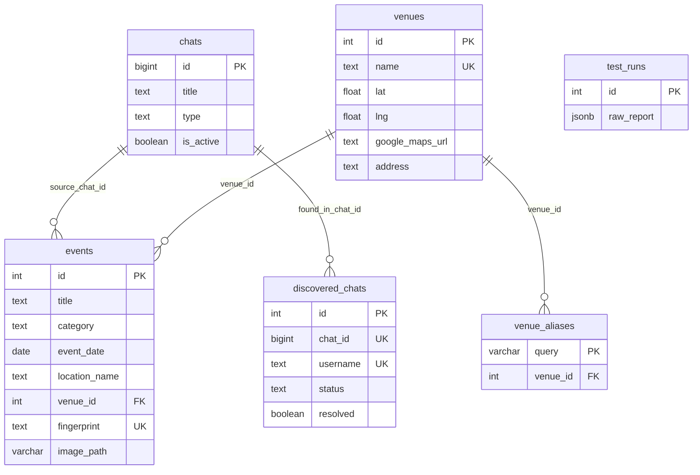

# Database Schema — TG Parser

**Database:** PostgreSQL · **Name:** `ThaiApp` · **User:** `thai_app_user`



---

## Таблица `chats`

Telegram-чаты/каналы, которые listener мониторит в реальном времени.

| Колонка | Тип | Nullable | Default | Описание |
|---|---|---|---|---|
| `id` | `bigint` | **NO** | — | PK, Telegram chat ID |
| `title` | `text` | **NO** | — | Название чата/канала |
| `type` | `text` | YES | — | `channel` / `megagroup` / `group` |
| `is_active` | `boolean` | YES | `true` | Активен ли мониторинг |
| `added_at` | `timestamptz` | YES | `now()` | Когда добавлен |
| `updated_at` | `timestamptz` | YES | `now()` | Последнее обновление |

**PK:** `id`

---

## Таблица `events`

Найденные офлайн-ивенты, извлечённые AI из сообщений.

| Колонка | Тип | Nullable | Default | Описание |
|---|---|---|---|---|
| `id` | `serial` | **NO** | auto | PK |
| `title` | `text` | **NO** | — | Название ивента (до 30 символов) |
| `category` | `text` | YES | — | `Party` / `Sport` / `Business` / `Education` / `Chill` |
| `event_date` | `date` | YES | — | Дата проведения |
| `event_time` | `text` | YES | — | Время в формате `HH:MM` |
| `location_name` | `text` | YES | — | Название площадки (как извлёк AI) |
| `venue_id` | `integer` | YES | — | FK → `venues.id` (после enrichment) |
| `price_thb` | `integer` | YES | `0` | Цена в батах (0 = бесплатно) |
| `summary` | `text` | YES | — | Краткое описание (до 80 символов) |
| `description` | `text` | YES | — | Полное описание (2-4 предложения) |
| `source_chat_id` | `bigint` | YES | — | FK → `chats.id`, откуда пришло |
| `source_chat_title` | `text` | YES | — | Название чата-источника |
| `message_id` | `bigint` | YES | — | Telegram message ID |
| `sender` | `text` | YES | — | Отправитель |
| `filter_score` | `integer` | YES | `0` | Балл pre-filter (0-7) |
| `original_text` | `text` | YES | — | Оригинальный текст сообщения |
| `source` | `text` | YES | `'listener'` | `listener` / `batch` |
| `fingerprint` | `text` | YES | — | MD5-хеш для дедупликации (UNIQUE) |
| `detected_at` | `timestamptz` | YES | `now()` | Время обнаружения |
| `image_path` | `varchar` | YES | — | Имя файла обложки (в `media/`) |

**PK:** `id` · **FK:** `venue_id → venues.id`, `source_chat_id → chats.id` · **UNIQUE:** `fingerprint`

**Индексы:**
| Имя | Тип | Описание |
|---|---|---|
| `idx_events_category` | btree | По категории |
| `idx_events_date` | btree (partial) | По дате (WHERE date IS NOT NULL) |
| `idx_events_detected` | btree DESC | По времени обнаружения (новые первые) |
| `idx_events_original_text_md5` | btree | MD5 текста для быстрой дедупликации |
| `idx_events_trgm` | GIN (pg_trgm) | Полнотекстовый поиск по title |

---

## Таблица `venues`

Площадки, обогащённые через Gemini + Google Search grounding.

| Колонка | Тип | Nullable | Default | Описание |
|---|---|---|---|---|
| `id` | `serial` | **NO** | auto | PK |
| `name` | `text` | **NO** | — | Официальное название (UNIQUE) |
| `name_normalized` | `text` | YES | — | Нормализованное имя для lookup |
| `lat` | `double` | YES | — | Широта |
| `lng` | `double` | YES | — | Долгота |
| `google_maps_url` | `text` | YES | — | Ссылка на Google Maps |
| `instagram_url` | `text` | YES | — | Instagram |
| `address` | `text` | YES | — | Физический адрес |
| `description` | `text` | YES | — | Описание площадки |
| `cached_at` | `timestamptz` | YES | `now()` | Время кэширования |

**PK:** `id` · **UNIQUE:** `name`

**Индексы:**
| Имя | Тип | Описание |
|---|---|---|
| `idx_venues_normalized` | btree (partial) | По нормализованному имени |

---

## Таблица `venue_aliases`

Маппинг запросов → venue. Кэш venue enricher: один venue может иметь несколько алиасов.

| Колонка | Тип | Nullable | Default | Описание |
|---|---|---|---|---|
| `query` | `varchar(255)` | **NO** | — | PK, нормализованный запрос |
| `venue_id` | `integer` | YES | — | FK → `venues.id` (NULL = not found) |
| `created_at` | `timestamptz` | YES | `utc_now()` | Время создания |

**PK:** `query` · **FK:** `venue_id → venues.id`

---

## Таблица `discovered_chats`

Чаты, обнаруженные spider-модулем через forwards, invite links, public links.

| Колонка | Тип | Nullable | Default | Описание |
|---|---|---|---|---|
| `id` | `serial` | **NO** | auto | PK |
| `chat_id` | `bigint` | YES | — | Telegram chat ID (после resolve) |
| `username` | `text` | YES | — | @username |
| `invite_link` | `text` | YES | — | t.me/joinchat/... или t.me/+... |
| `title` | `text` | YES | — | Название (после resolve) |
| `type` | `text` | YES | — | `channel` / `megagroup` / `group` |
| `source_type` | `text` | **NO** | — | `forward` / `public_link` / `invite_link` |
| `found_in_chat_id` | `bigint` | YES | — | FK → `chats.id`, где обнаружен |
| `participants_count` | `integer` | YES | — | Кол-во участников |
| `status` | `text` | YES | `'new'` | `new` / `approved` / `rejected` / `self` |
| `resolved` | `boolean` | YES | `false` | Данные получены через Telegram API |
| `times_seen` | `integer` | YES | `1` | Сколько раз встречался |
| `first_seen` | `timestamptz` | YES | `now()` | Первое обнаружение |
| `last_seen` | `timestamptz` | YES | `now()` | Последнее обнаружение |

**PK:** `id` · **FK:** `found_in_chat_id → chats.id`

**Уникальные partial-индексы (дедупликация):**
| Имя | Описание |
|---|---|
| `uq_discovered_chat_id` | UNIQUE `chat_id` WHERE NOT NULL |
| `uq_discovered_username` | UNIQUE `lower(username)` WHERE NOT NULL |
| `uq_discovered_invite` | UNIQUE `invite_link` WHERE NOT NULL |

**Partial-индексы (фильтрация):**
| Имя | Описание |
|---|---|
| `idx_discovered_status` | status WHERE status = 'new' |
| `idx_discovered_unresolved` | resolved WHERE resolved = false |

---

## Таблица `test_runs`

Результаты прогонов `test_listener.py`.

| Колонка | Тип | Nullable | Default | Описание |
|---|---|---|---|---|
| `id` | `serial` | **NO** | auto | PK |
| `elapsed_sec` | `real` | YES | — | Время выполнения (сек) |
| `chats_count` | `integer` | YES | — | Кол-во чатов |
| `batch_messages` | `integer` | YES | — | Сообщений в batch |
| `batch_filtered` | `integer` | YES | — | Прошло фильтр |
| `batch_events` | `integer` | YES | — | Найдено ивентов |
| `spider_discovered` | `integer` | YES | — | Spider находок |
| `spider_resolved` | `integer` | YES | — | Spider resolved |
| `live_messages` | `integer` | YES | — | Live сообщений |
| `live_events` | `integer` | YES | — | Live ивентов |
| `raw_report` | `jsonb` | YES | — | Полный JSON-отчёт |
| `created_at` | `timestamptz` | YES | `now()` | Время прогона |

**PK:** `id`

---

## Связи (Foreign Keys)

```
events.venue_id       → venues.id
events.source_chat_id → chats.id
venue_aliases.venue_id → venues.id
discovered_chats.found_in_chat_id → chats.id
```

## Текущие данные

| Таблица | Записей |
|---|---|
| `chats` | 28 |
| `events` | 104 |
| `venues` | 53 |
| `venue_aliases` | 56 |
| `discovered_chats` | 75 |
| `test_runs` | 3 |
